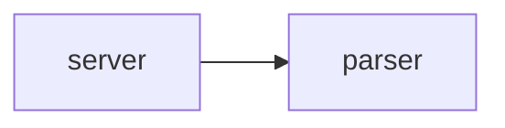

<!-- Generated by tattva from spec.json. Edits are detected and won't be overwritten; delete this file to regenerate it. -->
# Mini Redis

A tiny Redis.

**Target:** Redis · **Language:** go

## What this curriculum assumes

- comfortable with Go

## Scope

In scope:

- TCP server
- PING

Left out:

- **persistence**: not needed to learn the protocol

## How the real system is built

Redis is a single-threaded event-loop server.

## What you'll build

- **server**: accept connections (talks to parser)
- **parser**: parse RESP

## Program contract

Create an executable `run.sh` at the project root that builds your server if needed and starts it. Checks start `./run.sh` with no arguments, wait for port 6379, and talk to it over TCP.

## Concepts

- **Program contract** (`program-contract`): How checks run your program.
- **TCP sockets** (`tcp-sockets`): Listening for connections.
- **Message framing** (`message-framing`): Finding message boundaries in a byte stream.

## References

- [RESP spec](https://redis.io/docs/latest/develop/reference/protocol-spec/)

## Steps

Run `tattva next` to start the next step and `tattva status` to see your progress.

### Phase 1: Setup

Get a program running.

- **01 · Create run.sh**: run.sh starts a server on port 6379.

### Phase 2: Protocol

Speak RESP.

- **02 · Respond to PING**: Reply +PONG to PING. *(after 01)* *(not expanded yet)*
- **03 · Echo**: Reply to ECHO with its argument. *(after 02)* *(not expanded yet)*
